# ajisito

Primer ejercicio
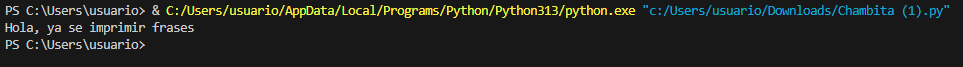
Segundo ejercicio
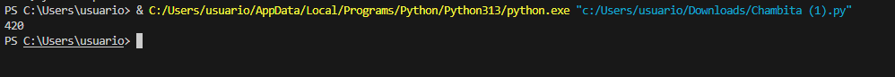
Tercer ejercicio
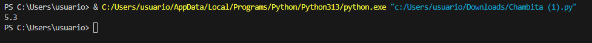
ejercicio 4
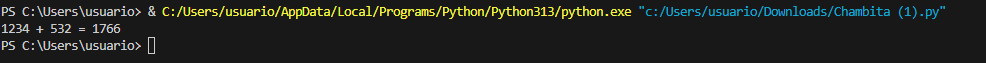
ejercicio 5
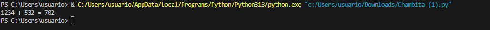
ejercicio 6
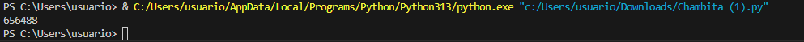
ejercicio 7
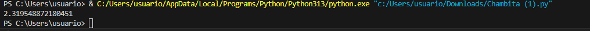
ejercicio 8
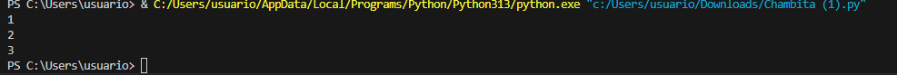
ejercicio 9
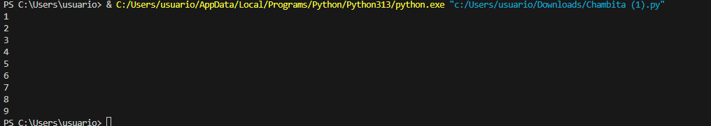
ejercicio 10
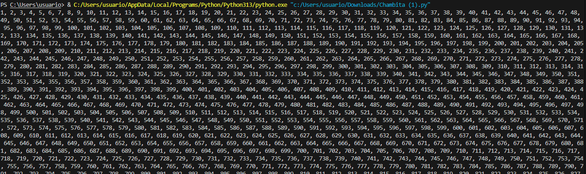
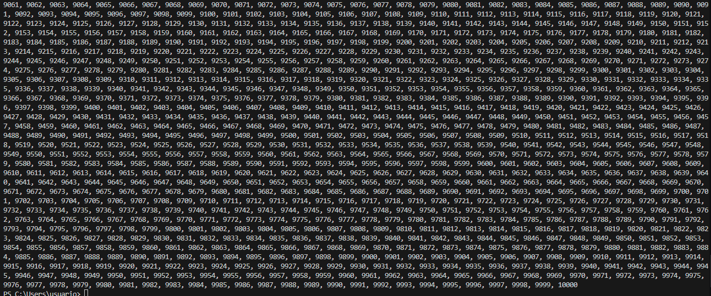
ejercicio 11
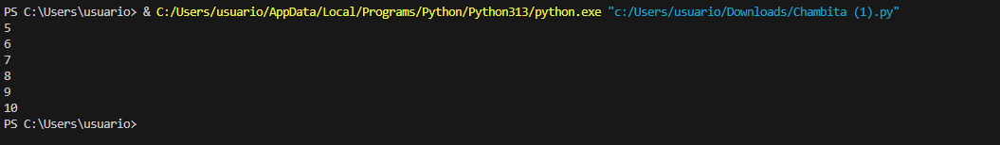
ejercicio 12
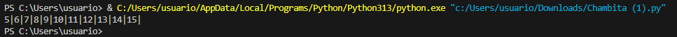
ejercicio 13
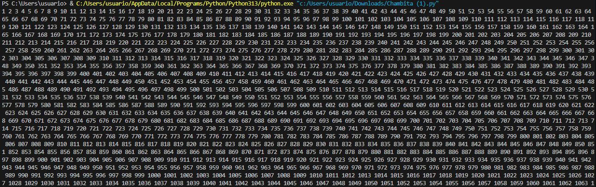
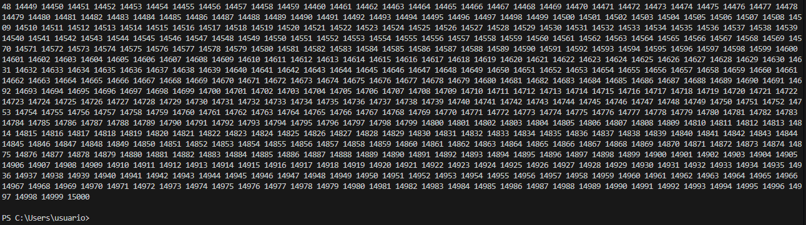
ejercicio 14
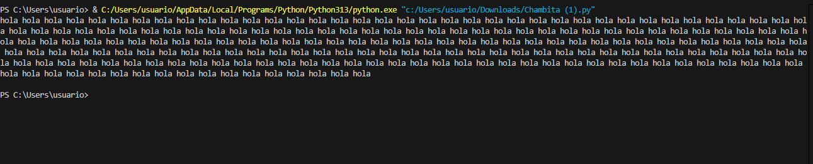
ejercicio 15
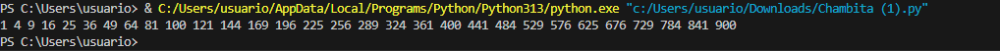
ejercicio 16
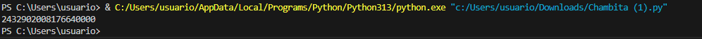
ejercicio 17
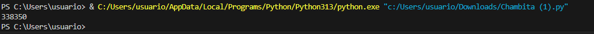
ejercicio 18
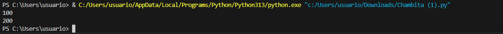
ejercicio 19
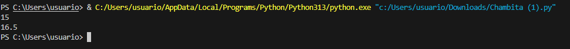
ejercicio 20
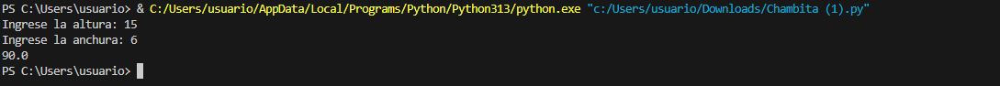
ejercicio 21
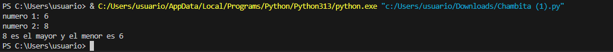
ejercicio 22
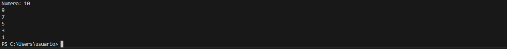
ejercicio 23
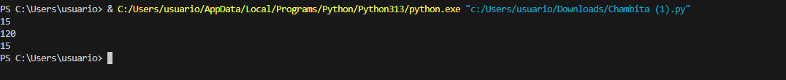
ejercicio 24
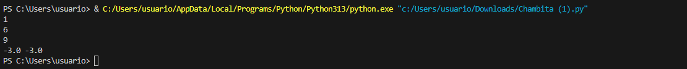
ejercicio 25
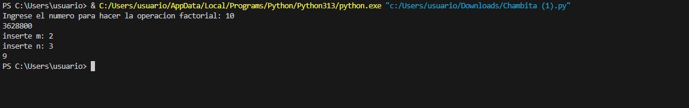
ejercicio 26
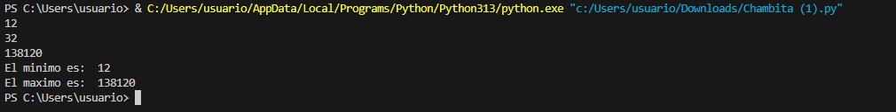
ejercicio 27
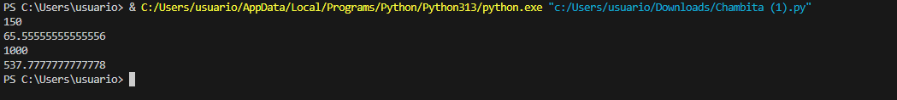
ejercicio 28
con break
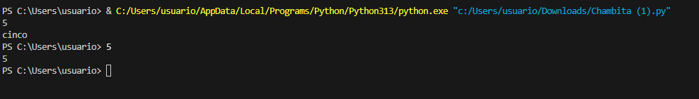
sin break 
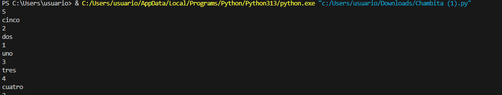
ejercicio 30
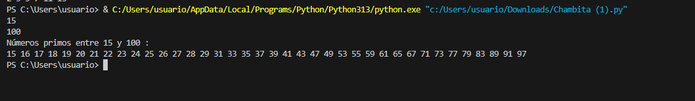